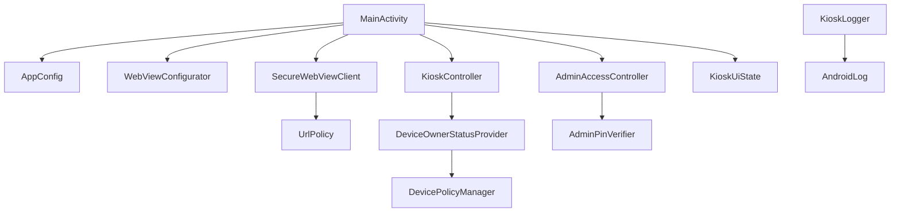
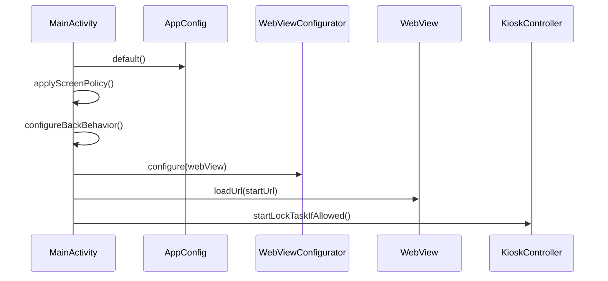
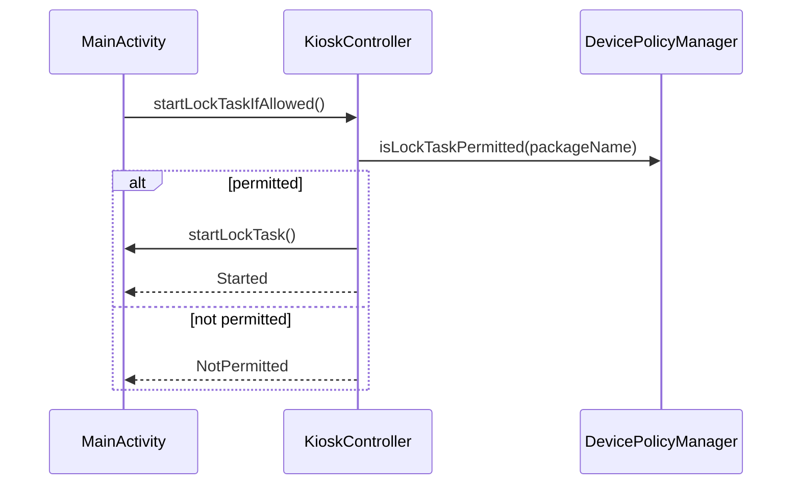
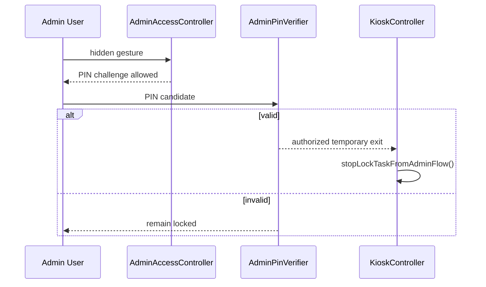
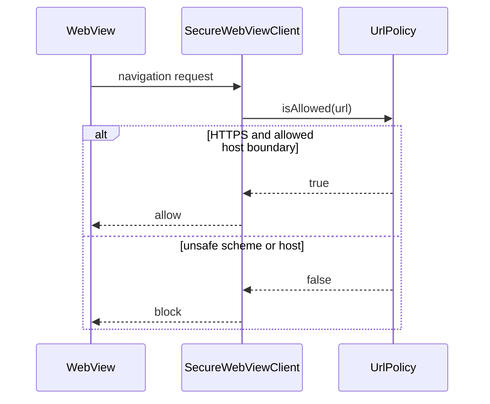

# Architecture

Fetchin Kiosk starts as one native Android app module with strict package boundaries. It avoids premature modularization while keeping security-sensitive rules isolated and testable.

## Goals

- Provide a dedicated tablet kiosk shell for an internal web system.
- Use WebView without depending on Google Chrome.
- Enforce URL allowlisting and block unsafe schemes.
- Support Device Owner provisioning and managed Lock Task Mode.
- Keep first implementation small, auditable, and testable.

## Non Goals

- Full MDM/EMM platform.
- Offline POS replacement.
- Browser feature parity.
- Multi-tab browsing.
- Arbitrary downloads or file uploads.
- Secret storage in source code.

## Components



## Responsibilities

| Component | Responsibility |
| --- | --- |
| `MainActivity` | Coordinate lifecycle, bind UI, delegate security decisions. |
| `AppConfig` | Centralize provisional defaults and construct policies. |
| `UrlPolicy` | Decide whether a URL may load. |
| `WebViewConfigurator` | Apply WebView security settings. |
| `SecureWebViewClient` | Route navigation through policy and report load state. |
| `KioskController` | Start/stop Lock Task only through controlled paths. |
| `DeviceOwnerStatusProvider` | Read Device Owner and Lock Task permission status. |
| `AdminAccessController` | Detect hidden gesture only; never authorize by itself. |
| `AdminPinVerifier` | Verifies admin PIN candidates without storing plain-text PIN values. |
| `KioskLogger` | Log administrative events without sensitive data. |

## Data Flow

```text
BuildConfig defaults -> AppConfig -> UrlPolicy/WebViewConfigurator/MainActivity -> WebView/KioskController
```

Future device configuration must flow through `AppConfig`; no component should read ad hoc preference keys.

## Activity Lifecycle

- `onCreate` inflates ViewBinding.
- Configuration is loaded once from defaults in the skeleton.
- Screen policy and immersive mode are applied.
- Back behavior is intercepted.
- WebView is configured and initial URL loaded.
- Lock Task is attempted only if permitted.
- `onResume` reapplies immersive mode because Android can clear system UI flags.

## State Handling

Current state is simple enum-like sealed objects in `KioskUiState`. Future work may introduce a ViewModel only when state becomes asynchronous or persistent enough to justify it.

## UI And Logic Separation

UI renders `KioskUiState`; security decisions live outside Activity. `MainActivity` must not inspect raw URLs or store PIN data.

## Configuration Design

Centralized settings planned:

| Setting | Current Source | Future Source |
| --- | --- | --- |
| Start URL | `BuildConfig.DEFAULT_START_URL` | Device-local or managed config |
| Allowed hosts | `BuildConfig.DEFAULT_ALLOWED_HOSTS` | Managed config |
| Orientation | Manifest landscape | Device config if required |
| Screenshots | `AppConfig.allowScreenshots` | Device config |
| WebView debugging | Build type | Build type only |
| Admin gesture | `AppConfig` | Device config |
| Admin unlock timeout | `BuildConfig.DEFAULT_ADMIN_SESSION_MILLIS` | Device config |
| User agent suffix | `AppConfig` | Device config |

## WebView Design

- JavaScript enabled provisionally because the internal web system likely requires it.
- DOM storage enabled provisionally for modern web app behavior.
- File access disabled.
- Content access disabled.
- Multiple windows disabled.
- Mixed content blocked.
- Safe Browsing enabled on API 26+.
- WebView debugging enabled only for debug builds.
- No JavaScript bridge by default.

## Kiosk Controller Design

`KioskController` wraps platform APIs. It allowlists the app package for Lock Task only when the app is Device Owner, then starts Lock Task when permitted. It must expose explicit results instead of swallowing provisioning failures. Full production confidence still requires real Device Owner validation.

## Administrative Access Design

The hidden gesture only opens a PIN challenge. The gesture is not authorization. PIN verification uses configurable PBKDF2 material with empty defaults in the repository. A valid PIN starts a timed maintenance session, attempts controlled Lock Task stop, and attempts Lock Task restart when the session ends. No real PIN belongs in source code.

## Persistence

No runtime persistence is implemented in the skeleton. DataStore Preferences is acceptable when device-local configuration is implemented.

## Error Handling

Current error UI distinguishes offline, HTTP/TLS failures, blocked navigation, renderer death recovery, provisioning status, admin challenge, and timed maintenance mode. Blank WebView detection remains future resilience work.

## Logs

Logs may include administrative event type and technical state. Logs must not include credentials, PINs, session tokens, full URLs containing sensitive query parameters, cookies, or personal data.

## Dependency Decisions

- AndroidX Core/AppCompat/Activity/Lifecycle for baseline Android compatibility.
- Material Components for XML theme/widgets.
- JUnit for unit tests.
- AndroidX Test/Espresso reserved for instrumented tests.
- No Hilt, Room, Retrofit, Firebase, Navigation, or Compose.

## Why Not More Complex

The MVP has one Activity, one WebView, one local configuration source, and a small policy set. Clean package boundaries provide enough separation without adding module and DI overhead.

## Evolution Paths

- Add ViewModel when state becomes asynchronous.
- Add DataStore for device-local config.
- Add managed configuration for MDM/EMM.
- Add QR provisioning profile.
- Add remote telemetry with privacy review.
- Split modules only if code size or team workflow demands it.

## Startup Sequence



## Lock Task Entry Sequence



## Admin Unlock Sequence



## URL Validation Sequence


