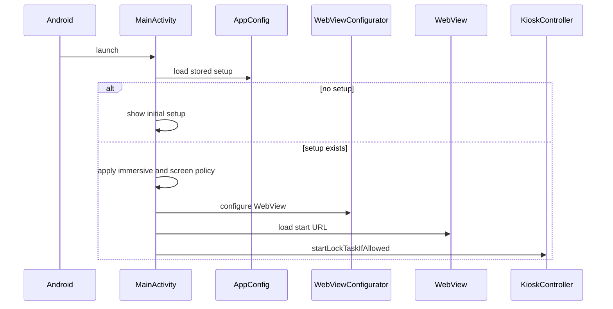

# Project Map

This file is the navigable map for Fetchin Kiosk. Keep it synchronized with real files.

## Root Tree

```text
.
├── AGENTS.md
├── README.md
├── build.gradle.kts
├── settings.gradle.kts
├── gradle.properties
├── gradlew
├── gradlew.bat
├── gradle/libs.versions.toml
├── gradle/wrapper/
├── app/
│   ├── build.gradle.kts
│   ├── proguard-rules.pro
│   └── src/
│       ├── main/
│       │   ├── AndroidManifest.xml
│       │   ├── java/com/fetchin/kiosk/
│       │   └── res/
│       ├── test/
│       └── androidTest/
└── docs/
    ├── adr/
    ├── ACCEPTANCE_CRITERIA.md
    ├── ARCHITECTURE.md
    ├── DEVICE_PROVISIONING.md
    ├── HANDOFF_ANTIGRAVITY.md
    ├── IMPLEMENTATION_PLAN.md
    ├── OPEN_QUESTIONS.md
    ├── PROJECT_MAP.md
    ├── PROJECT_STATUS.md
    ├── REVIEW_CHECKLIST.md
    ├── ROADMAP.md
    └── SECURITY_MODEL.md
```

## Root Files

| Path | Purpose |
| --- | --- |
| `AGENTS.md` | Binding rules for future agents. |
| `README.md` | Human entry point. |
| `settings.gradle.kts` | Gradle plugin repositories and included modules. |
| `build.gradle.kts` | Root Gradle plugin declarations. |
| `gradle.properties` | Gradle and AndroidX flags. |
| `gradle/libs.versions.toml` | Central dependency versions. |
| `gradlew`, `gradlew.bat` | Gradle wrapper entry points. |
| `gradle/wrapper/` | Gradle wrapper jar and distribution configuration. |

## App Structure

| Path | Purpose |
| --- | --- |
| `app/build.gradle.kts` | Android app module configuration. |
| `app/src/main/AndroidManifest.xml` | App permissions, main activity, device admin receiver. |
| `app/src/main/java/com/fetchin/kiosk/MainActivity.kt` | UI coordinator and lifecycle entry point. |
| `app/src/main/java/com/fetchin/kiosk/admin/` | Administrative access and DeviceAdminReceiver. |
| `app/src/main/java/com/fetchin/kiosk/config/` | Central app configuration. |
| `app/src/main/java/com/fetchin/kiosk/kiosk/` | Lock Task and Device Owner orchestration. |
| `app/src/main/java/com/fetchin/kiosk/security/` | Security logging and future security helpers. |
| `app/src/main/java/com/fetchin/kiosk/ui/` | UI state model. |
| `app/src/main/java/com/fetchin/kiosk/util/` | Platform utility abstractions. |
| `app/src/main/java/com/fetchin/kiosk/web/` | WebView configuration, client, and URL policy. |
| `app/src/test/java/com/fetchin/kiosk/web/` | Unit tests for URL policy. |

## Generated And Local Files

| Path | Purpose |
| --- | --- |
| `local.properties` | Local SDK path for this workstation; ignored by `.gitignore`. |
| `.gradle/`, `build/`, `app/build/` | Generated Gradle/build outputs; ignored by `.gitignore`. |

## Main Classes

| Class | Status | Responsibility |
| --- | --- | --- |
| `MainActivity` | Implemented initial | Coordinates first-run setup, UI, WebView setup, back handling, immersive mode, and kiosk lifecycle. |
| `AppConfig` | Implemented initial | Carries runtime start URL, allowed host, flags, and admin gesture values. |
| `InitialSetupConfigBuilder` | Implemented initial | Validates HTTPS URL/PIN setup and derives PBKDF2 PIN material. |
| `LocalAppConfigRepository` | Implemented initial | Persists first-run configuration in private app preferences. |
| `UrlPolicy` | Implemented | Validates HTTPS and allowlisted host boundaries, returning allow/block reasons. |
| `WebViewConfigurator` | Skeleton | Applies initial secure WebView settings. |
| `SecureWebViewClient` | Implemented initial | Blocks disallowed navigation, returns 403 for disallowed subresources, reports main-frame load errors, and handles renderer death. |
| `KioskController` | Implemented initial | Starts/stops Lock Task when permitted and exposes provisioning status. |
| `KioskProvisioningStatus` | Implemented initial | Carries Device Owner, Lock Task permission, and package state for UI decisions. |
| `DeviceOwnerStatusProvider` | Skeleton | Reads Device Owner and Lock Task status. |
| `KioskDeviceAdminReceiver` | Skeleton | Device admin receiver for provisioning. |
| `AdminAccessController` | Implemented initial | Tracks hidden tap gesture timing without authorizing kiosk exit. |
| `AdminPinVerifier` | Interface | Defines admin PIN verification boundary. |
| `AdminPinConfig` | Implemented initial | Holds PBKDF2 hash/salt/iteration configuration without storing a plain PIN. |
| `Pbkdf2AdminPinVerifier` | Implemented initial | Verifies PIN candidates against configurable PBKDF2 material and clears candidate arrays. |
| `KioskUiState` | Skeleton | Represents visual states. |
| `ConnectivityObserver` | Interface | Connectivity abstraction used before load/retry. |
| `AndroidConnectivityObserver` | Implemented initial | Checks Android validated internet capability. |
| `KioskLogger` | Skeleton | Future safe admin event logging boundary. |

## Startup Flow



## WebView Flow

```text
Start URL -> WebView -> SecureWebViewClient -> UrlPolicy -> allow HTTPS allowlisted host, show blocked state for blocked main-frame navigation, or return 403 for blocked subresources
```

## Kiosk Entry Flow

```text
MainActivity -> KioskController -> DevicePolicyManager status -> setLockTaskPackages when Device Owner and not already permitted -> startLockTask when allowed -> release blocks on not-provisioned -> debug loads with visible weaker fallback banner
```

## Admin Exit Flow

```text
Hidden gesture -> PIN dialog -> PBKDF2 verifier -> KioskController.stopLockTaskFromAdminFlow -> timed maintenance state -> return action or timeout -> KioskController.startLockTaskIfAllowed -> configured system or not-provisioned state
```

## Error Recovery Flow

Planned:

```text
Offline before load/retry -> offline state -> retry rechecks network -> WebView main-frame network/HTTP/TLS error -> load error state -> renderer death recreates WebView -> retry loads configured start URL
```

## Dependency Direction

```text
MainActivity -> config, kiosk, web, ui, admin
web -> ui
kiosk -> admin
config -> web
security -> Android Log only for now
```

## Configuration Location

- Runtime wrapper: `AppConfig`.
- First-run persistence: `LocalAppConfigRepository` with private `SharedPreferences`.
- Compile-time defaults: non-secret admin derivation parameters and debug flags in `app/build.gradle.kts`.
- Future remote configuration: out of MVP.

## Tests Location

- Unit tests: `app/src/test/java/`.
- Instrumented tests: `app/src/androidTest/java/`, currently empty.
